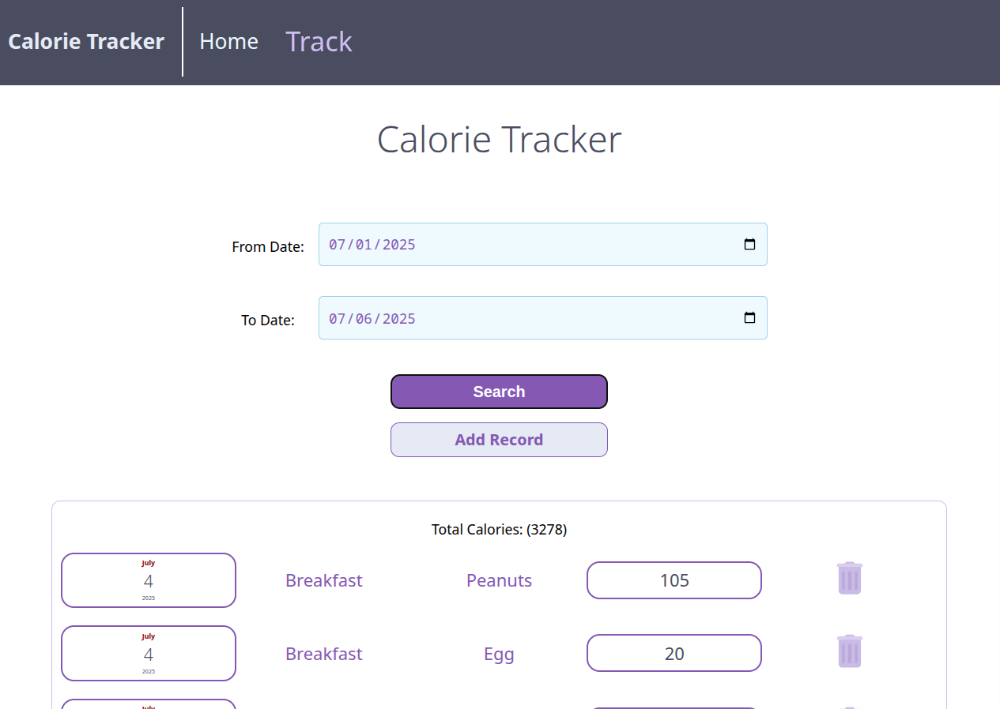
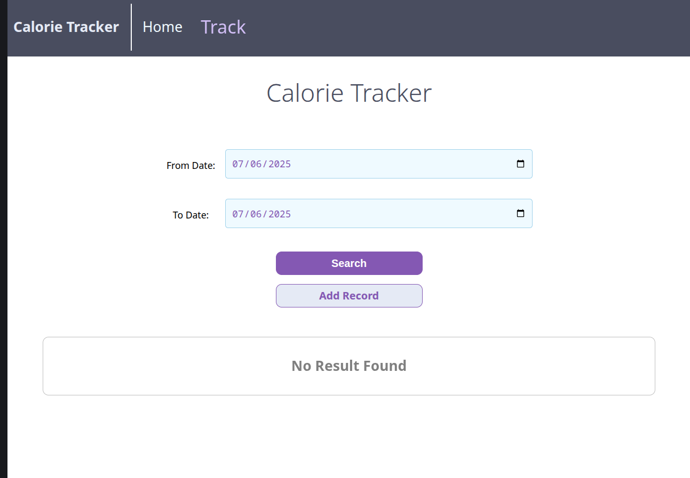

# Calorie Tracker Frontend

واجهة أمامية تفاعلية لإدارة وتتبع السعرات الحرارية، مبنية باستخدام [React](https://react.dev/) و [Vite](https://vitejs.dev/).  
تم تصميم التطبيق ليكون سهل الاستخدام، سريع الاستجابة، ومنظمًا بشكل يسمح بالتطوير المستقبلي بسهولة.

---

## 🖼️ لقطات من التطبيق

### شاشة تتبع السعرات والبحث



### عند عدم وجود نتائج بحث



### شاشة إضافة سجل جديد


---

## 🚀 البدء السريع

1. **تثبيت الاعتمادات:**

   ```sh
   npm install
   ```

2. **تشغيل البرنامج بالكامل (الواجهة الأمامية والخلفية):**

   تأكد من تثبيت الاعتمادات في كلا المجلدين `packages/client` و `packages/server`، ثم شغّل الأمر التالي من جذر المشروع:

   ```sh
   npm run start
   ```

   سيقوم هذا الأمر بتشغيل كل من الخادم الخلفي والواجهة الأمامية معًا في وضع التطوير.

3. **زيارة التطبيق:**

   افتح [http://localhost:5173](http://localhost:5173) في المتصفح لمعاينة التطبيق.

> **ملاحظة:** يجب التأكد من أن الخادم الخلفي يعمل حتى تعمل جميع الميزات (راجع [README.md](../server/README.md)).

---

## 🗂️ بنية المجلدات

```
packages/client/
  src/
    App.jsx                # نقطة الدخول الرئيسية للتطبيق
    AppContext.jsx         # إدارة الحالة العامة (Context API)
    main.jsx               # تهيئة React وDOM
    common/                # مكونات واجهة مستخدم قابلة لإعادة الاستخدام (أزرار، إدخالات...)
    components/            # مكونات متخصصة (سجلات، قوائم...)
    pages/                 # صفحات التطبيق (تتبع، تفاصيل، إضافة...)
    utils/                 # دوال وأدوات مساعدة (hooks, formatDate...)
  public/                  # ملفات ثابتة (أيقونات، صور...)
  index.html               # ملف HTML الرئيسي
  vite.config.js           # إعدادات Vite (مع دعم المسارات المختصرة)
```

### أهم الملفات والمجلدات

- [`src/App.jsx`](packages/client/src/App.jsx): تعريف المسارات والصفحات باستخدام React Router.
- [`src/AppContext.jsx`](packages/client/src/AppContext.jsx): إدارة الحالة العامة مثل التواريخ والسعرات.
- [`src/pages/TrackPage.jsx`](packages/client/src/pages/TrackPage.jsx): صفحة عرض وتتبع السجلات مع البحث بالتاريخ.
- [`src/pages/EditPage.jsx`](packages/client/src/pages/EditPage.jsx): صفحة إضافة سجل جديد.
- [`src/components/records/RecordList.jsx`](packages/client/src/components/records/RecordList.jsx): عرض قائمة السجلات.
- [`src/common/FormInput.jsx`](packages/client/src/common/FormInput.jsx): مكون إدخال موحد للنماذج.
- [`src/utils/hooks/useLoadData.js`](packages/client/src/utils/hooks/useLoadData.js): hook لجلب البيانات من الخادم.

---

## ✨ الميزات

- **إضافة/عرض/حذف السجلات** بسهولة وسرعة.
- **بحث متقدم حسب التاريخ** أو فترة زمنية محددة.
- **تصميم متجاوب** وواجهة مستخدم حديثة وسهلة الاستخدام.
- **إدارة حالة مركزية** باستخدام React Context لضمان تجربة سلسة.
- **تنظيم عالي للمجلدات** مع فصل واضح للمكونات والصفحات والأدوات.

---

## 🛠️ تطوير الواجهة

- استخدم المسارات المختصرة (alias) مثل `@common`, `@pages`, `@components` لتسهيل الاستيراد.
- جميع الأنماط مكتوبة بـ CSS Modules لضمان عدم تعارض الأنماط.
- يمكنك إضافة صفحات أو مكونات جديدة داخل مجلد `src/pages` أو `src/components` بسهولة.

---

## 📦 أمثلة على الاستيراد

```js
import { Button } from "@common";
import { TrackPage } from "@pages";
import { useLoadData } from "@utils/hooks";
```

---

> لمزيد من التفاصيل حول الواجهة الخلفية وواجهة الـ API راجع [packages/server/README.md](packages/server/README.md)
